## AWS 校園大使 - Node.js 進階應用
直播時間：5/11 (四) 20:00 ~ 21:00
校園大使：[Andy Lee](https://github.com/106207411), [Johnny Yeng](https://github.com/a2902793)

### 1. Fork This Repo
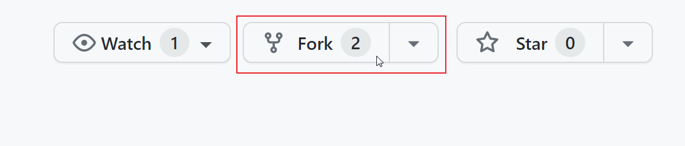

### 2. 建立 EC2 實例
可自己部署亦可參考下列方法
1. [註冊 AWS Educate 帳號](https://awseducate/1)
2. 開啟 [EC2 Lab](https://awseducate.instructure.com/courses/770/assignments/3187?module_item_id=13664)
3. EC2 的「安全群組」需允許 port 3000 的傳入規則
4. 從 AWS Educate `Details` 裡複製 Credentials
    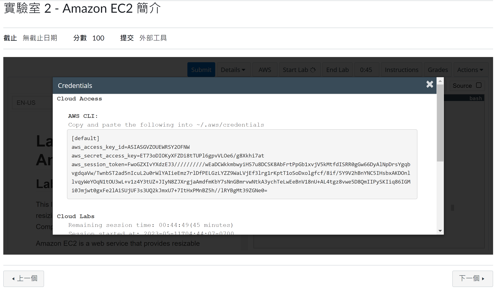
5. 因這次工作坊會在 port 3000 上，需在安全群組裡允許傳入規則
    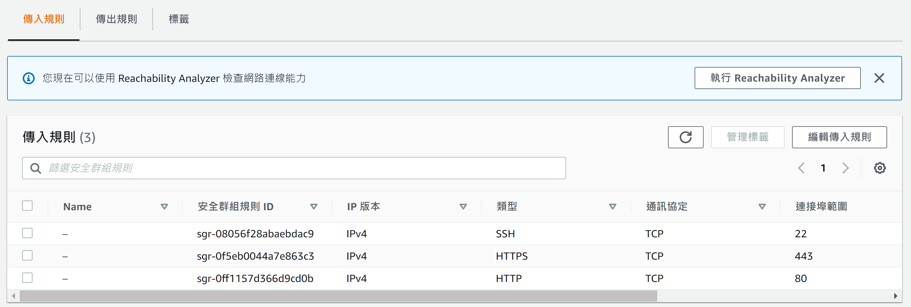
    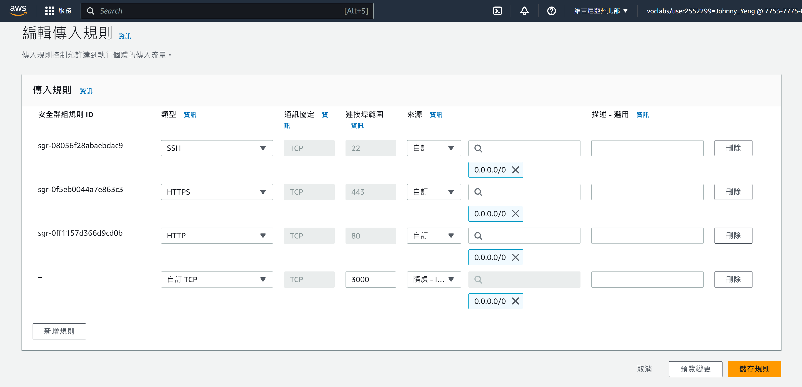

### 3. 設定 Github Actions 所需要用到的資訊
加入以下 key pair
- `HOST_DNS`：<PUBLIC_IPV4_DNS>
- `USERNAME`：ec2-user
- `EC2_SSH_KEY`：<YOUR_SSH_KEY><br>

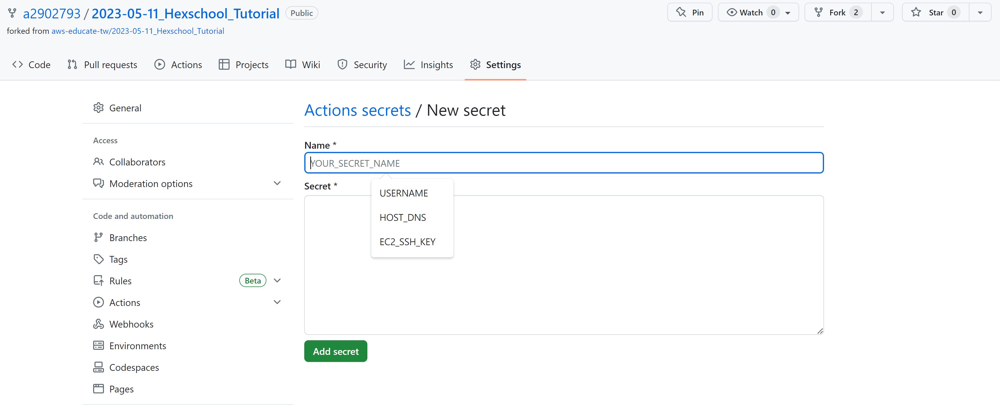

### 4. Clone 自己剛 fork 的 repo
```bash
sudo yum update
sudo yum install git -y
git clone <YOUR_OWN_REPO>
```

### 5. 安裝 Node
1. Connect to your Linux instance as ec2-user using SSH.
2. Install node version manager (nvm) by typing the following at the command line.
    ```bash
    curl -o- https://raw.githubusercontent.com/nvm-sh/nvm/v0.39.3/install.sh | bash
    ```
We will use nvm to install Node.js because nvm can install multiple versions of Node.js and allow you to switch between them.

3. Activate nvm by typing the following at the command line.
    ```bash
    . ~/.nvm/nvm.sh
    ```

4. Use nvm to install the latest version of Node.js by typing the following at the command line.
    > Amazon Linux 2 does not currently support the current LTS release (version 18.x) of Node.js. Use Node.js version 16.x with the following command instead.
    ```bash
    nvm install 16
    nvm use 16
    ```
    
    Installing Node.js also installs the Node Package Manager (npm) so you can install additional modules as needed.
5. Test that Node.js is installed and running correctly by typing the following at the command line.
    ```bash
    node -e "console.log('Running Node.js ' + process.version)"
    ```
    This displays the following message that shows the version of Node.js that is running.
    `Running Node.js VERSION`

### 6. 執行範例 webapp
1. 進到專案資料夾
    ```bash
    cd 2023-05-11_Hexschool_Tutorial
    ```
2. 安裝相依套件
    ```bash
    npm install
    npm install pm2 -g
    ```
3. 執行
    ```bash
    pm2 start index.js
    ```
### 7. 建立 S3 實例
1. 使用無痕或是另一個瀏覽器開 [S3 Lab](https://awseducate.instructure.com/courses/770/assignments/3186?module_item_id=13663)
2. 建立 S3 儲存佇體
    > `region`: `us-east-1`<br>`bucket-name`: <YOUR_S3_NAME>

### 8. 測試
1. 開啟 EC2 的公開網址 `<PUBLIC_IPV4_DNS>`
    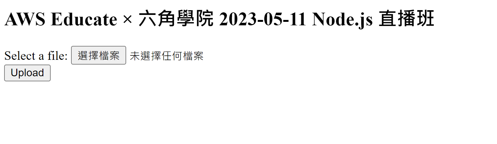
2. 上傳檔案後，因沒有將 S3 credentials，上傳會失敗並顯示錯誤訊息
    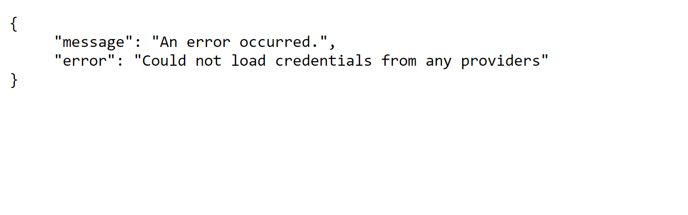

### 9. 修正 S3 Credentials
為了我們專案能成功上傳檔案至 S3，需要有 S3 的上傳 credentials。
建議作法是透過 API Gateway 加上適當的權限，方便起見我們這裡是直接使用 `Token + Access Key`
> 注意！如果是使用 AWS Educate 的方式開分別開兩個 Lab，這裡的 credentials 是 <ins><b>S3 的 Lab</b></ins>！

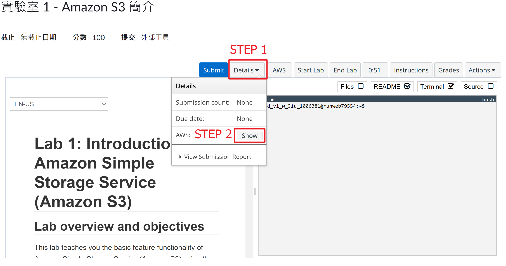
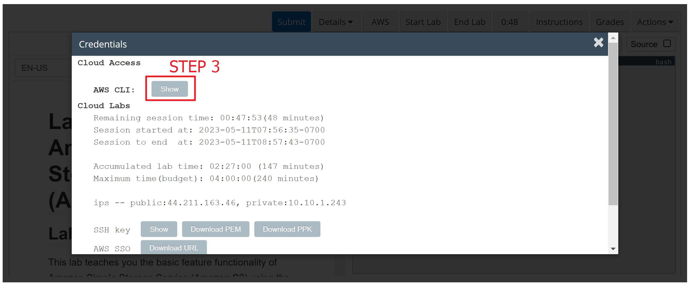
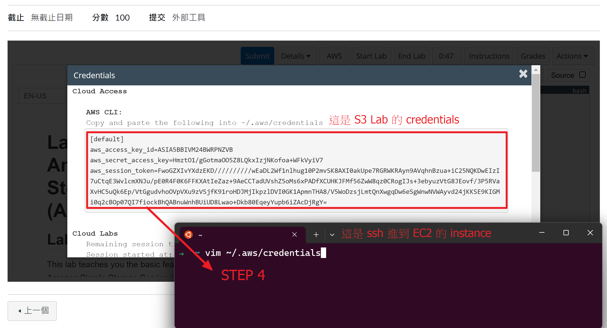

### 10. 開啟 Github Actions
1. 開啟功能
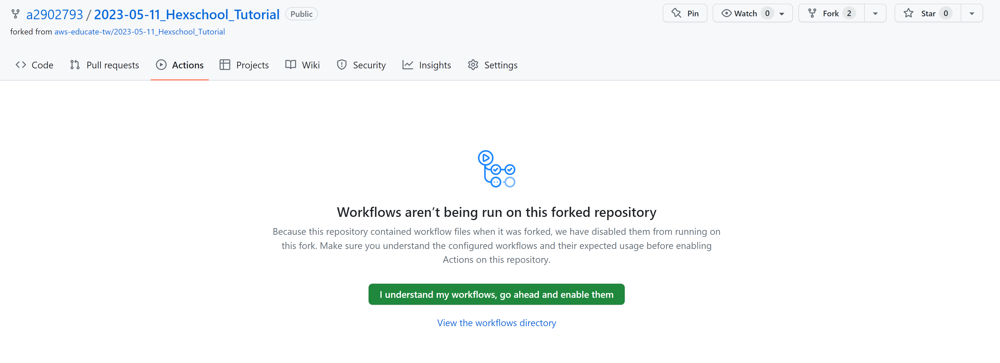
2. 使用 Github Codespaces 在 `fileparser.js` 加入 `region` 及 `bucket-name`
3. 儲存後會觸發 Github Actions 做自動化部署
4. Build Pass 🎉
    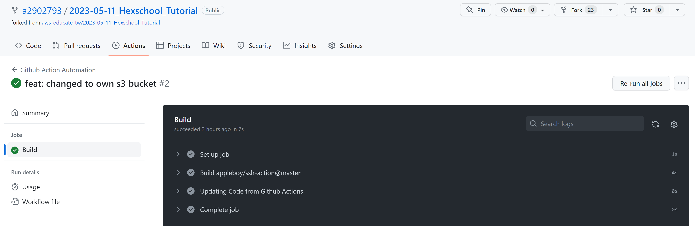

### 11. 再測試
1. 嘗試上傳檔案

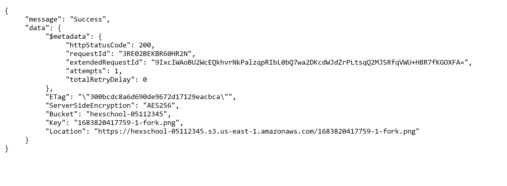

### Reference
[link](https://github.com/Fiyin-Anne/node-s3-upload)